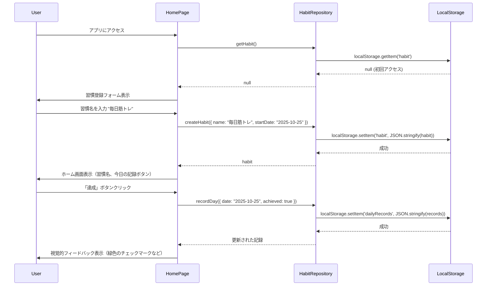
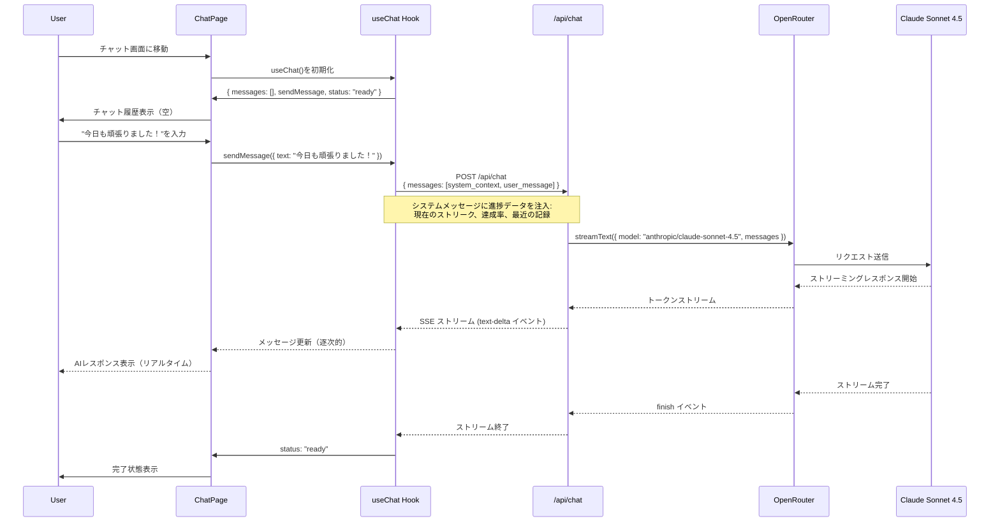
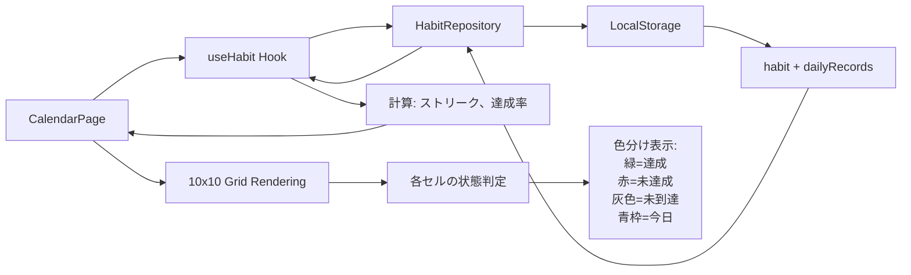

# Technical Design Document: habit100-ai-coach

## Overview

habit100-ai-coachは、ユーザーが1つの習慣を100日間継続するためのWebアプリケーションです。Next.js 15 App Router、React 19、Tailwind CSS v4を基盤とし、OpenRouter経由でClaude Sonnet 4.5を活用したAIコーチング機能を提供します。

**Purpose**: ユーザーに習慣形成の成功体験を提供し、AIによるパーソナライズされたサポートで継続率を向上させます。

**Users**: 習慣を身につけたい全ての人。特に過去に挫折経験があり、継続的なサポートを必要とするユーザーをターゲットとします。

**Impact**: 既存のNext.jsテンプレートアプリケーションに、完全な習慣トラッキングとAIコーチング機能を追加します。

### Goals

- ユーザーが1つの習慣を登録し、100日間の進捗を追跡できる
- 10×10カレンダーグリッドで視覚的に進捗を把握できる
- AIコーチ（Claude Sonnet 4.5）がパーソナライズされたアドバイスを提供する
- LocalStorageでデータを永続化し、ブラウザ再起動後もデータが保持される
- レスポンシブデザインで、スマートフォン・タブレット・デスクトップで利用可能

### Non-Goals

- 複数習慣の同時トラッキング（Phase 1では1習慣に集中）
- ユーザー認証・ログイン機能（将来のPhase 2で検討）
- クラウドデータベースへの同期（LocalStorageのみ、将来的にVercel Postgresへ移行可能な設計）
- ソーシャル機能（他のユーザーとの共有など）
- モバイルアプリ（PWA対応は将来検討）

## Architecture

### High-Level Architecture

```mermaid
graph TB
    subgraph "Client Layer"
        UI[React Components]
        Hooks[Custom Hooks]
        Storage[LocalStorage Manager]
    end

    subgraph "API Layer"
        ChatAPI[/api/chat Route]
    end

    subgraph "External Services"
        OpenRouter[OpenRouter API]
        Claude[Claude Sonnet 4.5]
    end

    UI --> Hooks
    Hooks --> Storage
    Hooks --> ChatAPI
    ChatAPI --> OpenRouter
    OpenRouter --> Claude
    Claude --> OpenRouter
    OpenRouter --> ChatAPI
    ChatAPI --> Hooks
    Hooks --> UI
```

### Technology Stack and Design Decisions

#### Frontend Layer

**選択**: Next.js 15.5.4 (App Router) + React 19.1.0 + TypeScript 5.x
- **Rationale**:
  - App Routerの Server Components で初期ロードパフォーマンスを最適化
  - React 19の新機能（useOptimistic、useActionState）でUI状態管理を簡素化
  - TypeScriptで型安全性を確保
- **Alternatives**:
  - Vite + React SPA: Next.jsほどのSSR/RSCメリットがない
  - Remix: 学習コストが高く、エコシステムが小さい

**選択**: Tailwind CSS v4
- **Rationale**:
  - ユーティリティファーストで迅速なUI開発が可能
  - v4のPostCSS統合で設定がシンプル
  - レスポンシブデザインが容易
- **Alternatives**:
  - CSS Modules: スタイル記述量が多く、開発速度が遅い
  - styled-components: ランタイムオーバーヘッドがある

#### AI Integration Layer

**選択**: Vercel AI SDK 5.0.60 + OpenRouter Provider 1.2.0
- **Rationale**:
  - ストリーミングレスポンスの統一的なインターフェース
  - OpenRouterで数百のAIモデルにアクセス可能（将来の柔軟性）
  - Claude Sonnet 4.5の高度なコーディング・推論能力を活用
- **Alternatives**:
  - Anthropic SDK直接利用: OpenRouterほど柔軟性がない
  - LangChain: 過剰な抽象化で学習コストが高い

**選択**: Claude Sonnet 4.5 (`anthropic/claude-sonnet-4.5`)
- **Rationale**:
  - SWE-bench Verifiedで最高水準の性能
  - システム設計、コードセキュリティ、仕様準拠で優れた性能
  - パーソナライズされたアドバイス生成に最適
- **Alternatives**:
  - GPT-4: コーディング性能でClaude Sonnet 4.5に劣る
  - Gemini: OpenRouterでの統合がまだ限定的

#### Data Persistence Layer

**選択**: LocalStorage（Phase 1）
- **Rationale**:
  - 認証不要で即座に利用開始可能
  - シンプルな実装で開発速度を優先
  - 抽象化レイヤーで将来的にVercel Postgresへ移行可能
- **Alternatives**:
  - IndexedDB: 構造化データには過剰、学習コストが高い
  - Vercel Postgres (即時導入): 認証実装が必要で初期MVPには過剰

#### Testing Layer

**選択**: Vitest 3.2.4 + Testing Library
- **Rationale**:
  - Viteベースで高速なテスト実行
  - Jest互換APIで学習コストが低い
  - Testing Libraryでユーザー中心のテスト
- **Alternatives**:
  - Jest: Vitestより遅い、設定が複雑

### Key Design Decisions

#### Decision 1: LocalStorage抽象化レイヤーの導入

**Context**: Phase 1ではLocalStorageを使用するが、将来的にVercel Postgresへ移行する可能性がある。

**Alternatives**:
1. LocalStorageを直接使用（抽象化なし）
2. Repository Patternで抽象化
3. React ContextでStorageを注入

**Selected Approach**: Repository Patternで抽象化
- `HabitRepository` インターフェースを定義
- `LocalStorageHabitRepository` 実装を提供
- 将来、`SupabaseHabitRepository` や `PostgresHabitRepository` に差し替え可能

**Rationale**:
- データアクセスロジックがコンポーネントから分離され、テストが容易
- ストレージ実装の変更がUIに影響しない
- TypeScriptのインターフェースで契約を明確化

**Trade-offs**:
- 獲得: 柔軟性、テスタビリティ、保守性
- 犠牲: 初期実装の複雑さが若干増加（+15%程度のコード量）

#### Decision 2: AIコンテキスト設計（進捗データの自動注入）

**Context**: AIに効果的なアドバイスを提供させるため、ユーザーの進捗データ（達成率、ストリーク、最近の記録）をコンテキストとして注入する必要がある。

**Alternatives**:
1. ユーザーが手動で進捗を説明
2. システムメッセージで進捗データを自動注入
3. 各メッセージのコンテキストに進捗データを含める

**Selected Approach**: システムメッセージで進捗データを自動注入
- チャット開始時にシステムメッセージで現在の進捗データを提供
- ユーザーメッセージには進捗データを含めない

**Rationale**:
- ユーザーの入力負荷が最小
- AIが常に最新の進捗データを把握
- トークン効率が良い（毎回送信する必要がない）

**Trade-offs**:
- 獲得: ユーザー体験、AIの応答品質、トークン効率
- 犠牲: システムメッセージの構築ロジックが必要

#### Decision 3: カレンダー実装（10×10固定グリッド vs 動的レンダリング）

**Context**: 100日間の進捗を表示するカレンダーUIの実装方法。

**Alternatives**:
1. 10×10の固定グリッド（配列を100要素で生成）
2. 動的レンダリング（実際の日数に応じて生成）
3. ライブラリ使用（react-calendar など）

**Selected Approach**: 10×10の固定グリッド
- `Array.from({ length: 100 })` で100セルを生成
- 各セルに日付インデックス（0-99）を割り当て
- 習慣開始日からの経過日数で達成状態を判定

**Rationale**:
- シンプルで理解しやすい
- パフォーマンスが予測可能
- ライブラリ依存なし

**Trade-offs**:
- 獲得: シンプルさ、パフォーマンス、保守性
- 犠牲: 柔軟性（100日以外に対応しづらい）

## System Flows

### User Interaction Flow: 習慣の登録から記録まで



### AI Coaching Flow: AIとの対話



### Data Flow: カレンダー表示



## Requirements Traceability

| Requirement | Summary | Components | Interfaces | Flows |
|-------------|---------|------------|------------|-------|
| 1.1 | 習慣登録フォーム表示 | HomePage, HabitForm | HabitRepository.getHabit() | User Interaction Flow |
| 1.2 | 習慣の保存 | HabitRepository | createHabit(data) | User Interaction Flow |
| 2.1 | 今日の記録ボタン表示 | HomePage, RecordButton | - | User Interaction Flow |
| 2.2 | 達成記録の保存 | HabitRepository | recordDay(data) | User Interaction Flow |
| 3.1 | 10×10カレンダー表示 | CalendarPage, CalendarGrid | useHabit() | Data Flow |
| 3.5 | ストリーク計算 | useHabit Hook | calculateStreak() | Data Flow |
| 4.2 | AIメッセージ送信 | ChatPage, useChat | /api/chat (POST) | AI Coaching Flow |
| 4.3 | ストリーミングレスポンス | useChat Hook | SSE処理 | AI Coaching Flow |
| 4.4 | 進捗コンテキスト注入 | /api/chat Route | buildSystemMessage() | AI Coaching Flow |
| 5.1-5.4 | データ永続化 | HabitRepository | LocalStorage API | All Flows |
| 6.1 | レスポンシブデザイン | All Components | Tailwind CSS | - |

## Components and Interfaces

### Frontend Layer

#### HomePage Component

**Responsibility & Boundaries**
- **Primary Responsibility**: 習慣の登録、今日の記録、進捗サマリーの表示
- **Domain Boundary**: Habitドメインの中心的なUI
- **Data Ownership**: なし（HabitRepositoryに委譲）

**Dependencies**
- **Inbound**: なし（トップレベルページ）
- **Outbound**: HabitRepository, useHabit Hook, RecordButton Component
- **External**: なし

**Contract Definition**

```typescript
// app/page.tsx
export default function HomePage(): React.ReactElement;

// 内部で使用するHook
function useHabit(): {
  habit: Habit | null;
  dailyRecords: DailyRecord[];
  createHabit: (data: CreateHabitInput) => Promise<void>;
  recordDay: (data: RecordDayInput) => Promise<void>;
  streak: number;
  achievementRate: number;
  isLoading: boolean;
  error: Error | null;
};
```

**State Management**
- **State Model**: 習慣データの有無（null | Habit）、ローディング状態、エラー状態
- **Persistence**: LocalStorageを経由してHabitRepositoryが管理
- **Concurrency**: なし（シングルユーザー）

---

#### CalendarPage Component

**Responsibility & Boundaries**
- **Primary Responsibility**: 100日間の進捗をカレンダー形式で表示
- **Domain Boundary**: 進捗の可視化
- **Data Ownership**: なし（読み取りのみ）

**Dependencies**
- **Inbound**: ナビゲーションからアクセス
- **Outbound**: HabitRepository, CalendarGrid Component
- **External**: なし

**Contract Definition**

```typescript
// app/calendar/page.tsx
export default function CalendarPage(): React.ReactElement;

// CalendarGrid Component
interface CalendarGridProps {
  startDate: Date;
  dailyRecords: DailyRecord[];
  onCellClick: (dayIndex: number) => void;
}

function CalendarGrid(props: CalendarGridProps): React.ReactElement;
```

**State Management**
- **State Model**: 選択されたセルの詳細表示状態
- **Persistence**: なし（一時的なUI状態のみ）

---

#### ChatPage Component

**Responsibility & Boundaries**
- **Primary Responsibility**: AIコーチとのチャットインターフェース
- **Domain Boundary**: AIコーチング機能
- **Data Ownership**: なし（useChat Hookに委譲）

**Dependencies**
- **Inbound**: ナビゲーションからアクセス
- **Outbound**: useChat Hook (Vercel AI SDK), HabitRepository
- **External**: /api/chat エンドポイント

**Contract Definition**

```typescript
// app/chat/page.tsx
export default function ChatPage(): React.ReactElement;

// Vercel AI SDK useChat Hook
import { useChat } from '@ai-sdk/react';

const {
  messages,        // UIMessage[]
  sendMessage,     // (params: { text: string }) => Promise<void>
  status,          // "ready" | "submitted" | "streaming" | "error"
  error,           // Error | null
  reload,          // () => void
} = useChat();
```

**State Management**
- **State Model**: チャット履歴（messages配列）、ストリーミング状態
- **Persistence**: LocalStorageに会話履歴を保存（オプション）

---

### Data Access Layer

#### HabitRepository

**Responsibility & Boundaries**
- **Primary Responsibility**: 習慣データと日次記録の永続化・取得
- **Domain Boundary**: データアクセスレイヤー
- **Data Ownership**: LocalStorage内のhabit、dailyRecords
- **Transaction Boundary**: 単一操作ごと（LocalStorageはトランザクションをサポートしない）

**Dependencies**
- **Inbound**: useHabit Hook, HomePage, CalendarPage
- **Outbound**: LocalStorage API
- **External**: なし

**Service Interface**

```typescript
interface HabitRepository {
  // 習慣の取得
  getHabit(): Habit | null;

  // 習慣の作成
  createHabit(data: CreateHabitInput): Habit;

  // 習慣の更新
  updateHabit(data: UpdateHabitInput): Habit;

  // 日次記録の取得
  getDailyRecords(): DailyRecord[];

  // 日次記録の作成・更新
  recordDay(data: RecordDayInput): DailyRecord;

  // 全データのクリア（テスト・リセット用）
  clear(): void;
}

interface CreateHabitInput {
  name: string;
  startDate: Date;
}

interface UpdateHabitInput {
  id: string;
  name?: string;
}

interface RecordDayInput {
  date: Date;
  achieved: boolean;
  note?: string;
}
```

**Preconditions**:
- createHabit: 既存の習慣が存在しない
- recordDay: 有効な習慣が存在する

**Postconditions**:
- createHabit: LocalStorageに習慣データが保存され、返されたHabitオブジェクトが有効
- recordDay: LocalStorageに日次記録が保存され、返されたDailyRecordが有効

**Invariants**:
- 同時に存在できる習慣は1つのみ（Phase 1制約）
- 各日付の記録は最大1つ

**Integration Strategy**:
- **Modification Approach**: 新規作成（既存システムなし）
- **Migration Path**: 将来的にインターフェースを維持しながら、実装を `SupabaseHabitRepository` や `PostgresHabitRepository` に差し替え

---

### API Layer

#### POST /api/chat

**Responsibility & Boundaries**
- **Primary Responsibility**: AIチャットリクエストの処理とストリーミングレスポンス生成
- **Domain Boundary**: AIコーチング機能のバックエンド
- **Data Ownership**: なし（ステートレス）

**Dependencies**
- **Inbound**: ChatPage (useChat Hook)
- **Outbound**: OpenRouter API (Vercel AI SDK経由)
- **External**: OpenRouter, Claude Sonnet 4.5

**API Contract**

| Method | Endpoint | Request | Response | Errors |
|--------|----------|---------|----------|--------|
| POST | /api/chat | ChatRequest | StreamingResponse | 400, 500, 502 |

**Request Schema**:

```typescript
interface ChatRequest {
  messages: UIMessage[];
}

interface UIMessage {
  id: string;
  role: "user" | "assistant" | "system";
  parts: Array<{
    type: "text";
    text: string;
  }>;
}
```

**Response Schema**:

```typescript
// Server-Sent Events (SSE) ストリーム
// Content-Type: text/event-stream

// イベント例
data: {"type":"text-delta","textDelta":"こんにち"}
data: {"type":"text-delta","textDelta":"は！"}
data: {"type":"finish","finishReason":"stop"}
```

**Error Responses**:

```typescript
// 400 Bad Request
{
  "error": {
    "type": "validation_error",
    "message": "Messages array must not be empty",
    "code": "INVALID_MESSAGES"
  }
}

// 500 Internal Server Error
{
  "error": {
    "type": "api_error",
    "message": "OPENROUTER_API_KEY environment variable is not set",
    "code": "OPENROUTER_INIT_ERROR"
  }
}
```

**Implementation Details**:

```typescript
// app/api/chat/route.ts
import { streamText, convertToModelMessages } from 'ai';
import { createOpenRouter } from '@openrouter/ai-sdk-provider';

const openrouter = createOpenRouter({
  apiKey: process.env.OPENROUTER_API_KEY,
});

export async function POST(request: Request) {
  const { messages } = await request.json();

  // バリデーション
  if (!messages || messages.length === 0) {
    return Response.json(
      { error: { type: "validation_error", message: "Messages array must not be empty", code: "INVALID_MESSAGES" } },
      { status: 400 }
    );
  }

  // システムメッセージに進捗データを注入
  const systemMessage = buildSystemMessage(); // 後述
  const allMessages = [systemMessage, ...messages];

  // ストリーミングレスポンス生成
  const result = streamText({
    model: openrouter('anthropic/claude-sonnet-4.5'),
    messages: convertToModelMessages(allMessages),
  });

  return result.toUIMessageStreamResponse();
}
```

**System Message Construction**:

```typescript
function buildSystemMessage(): UIMessage {
  // HabitRepositoryから現在の進捗データを取得
  const habit = habitRepository.getHabit();
  const records = habitRepository.getDailyRecords();

  if (!habit) {
    return {
      id: 'system',
      role: 'system',
      parts: [{
        type: 'text',
        text: 'あなたは習慣形成をサポートするAIコーチです。ユーザーの習慣継続を励まし、パーソナライズされたアドバイスを提供してください。'
      }]
    };
  }

  const streak = calculateStreak(records);
  const achievementRate = calculateAchievementRate(records);
  const recentRecords = records.slice(-7); // 最近7日間

  return {
    id: 'system',
    role: 'system',
    parts: [{
      type: 'text',
      text: `あなたは習慣形成をサポートするAIコーチです。

現在のユーザー情報:
- 習慣名: ${habit.name}
- 開始日: ${habit.startDate}
- 現在のストリーク: ${streak}日連続達成
- 全体の達成率: ${achievementRate}%
- 最近7日間の記録: ${recentRecords.map(r => r.achieved ? '✓' : '✗').join(' ')}

ユーザーの進捗に基づいて、パーソナライズされたアドバイス、励まし、挫折予防のサポートを提供してください。マイルストーン（7日、30日、50日、100日）到達時は特に祝福してください。`
    }]
  };
}
```

## Data Models

### Domain Model

#### Habit (習慣)

**Entity**: 習慣

```typescript
interface Habit {
  id: string;                // UUID
  name: string;              // 習慣名（例: "毎日筋トレ"）
  startDate: Date;           // 開始日
  createdAt: Date;           // 作成日時
  updatedAt: Date;           // 更新日時
}
```

**Business Rules**:
- 習慣名は1文字以上100文字以下
- startDateは過去または今日の日付
- Phase 1では同時に1つの習慣のみ存在可能

---

#### DailyRecord (日次記録)

**Entity**: 日次記録

```typescript
interface DailyRecord {
  id: string;                // UUID
  habitId: string;           // 習慣ID（外部キー）
  date: Date;                // 記録日（YYYY-MM-DD）
  achieved: boolean;         // 達成フラグ
  note?: string;             // メモ（オプション）
  createdAt: Date;           // 作成日時
  updatedAt: Date;           // 更新日時
}
```

**Business Rules**:
- 各日付には最大1つの記録のみ
- dateは習慣のstartDate以降の日付
- 未来の日付は記録不可
- noteは最大500文字

---

#### ChatMessage (チャット履歴)

**Value Object**: チャットメッセージ

```typescript
interface ChatMessage {
  id: string;                // UUID
  role: "user" | "assistant" | "system";
  content: string;           // メッセージ内容
  timestamp: Date;           // 送信日時
}
```

**Business Rules**:
- contentは空文字列不可
- システムメッセージは表示しない（内部用）

---

### Physical Data Model (LocalStorage)

#### LocalStorage Keys

| Key | Type | Description |
|-----|------|-------------|
| `habit` | `Habit` | 現在の習慣データ |
| `dailyRecords` | `DailyRecord[]` | 全ての日次記録 |
| `chatHistory` | `ChatMessage[]` | チャット履歴（オプション） |

#### Data Structure

```typescript
// LocalStorage 'habit' key
{
  "id": "uuid-v4",
  "name": "毎日筋トレ",
  "startDate": "2025-10-25T00:00:00.000Z",
  "createdAt": "2025-10-25T01:26:30.000Z",
  "updatedAt": "2025-10-25T01:26:30.000Z"
}

// LocalStorage 'dailyRecords' key
[
  {
    "id": "uuid-v4-1",
    "habitId": "uuid-v4",
    "date": "2025-10-25T00:00:00.000Z",
    "achieved": true,
    "note": "20回できた！",
    "createdAt": "2025-10-25T10:00:00.000Z",
    "updatedAt": "2025-10-25T10:00:00.000Z"
  },
  {
    "id": "uuid-v4-2",
    "habitId": "uuid-v4",
    "date": "2025-10-26T00:00:00.000Z",
    "achieved": false,
    "createdAt": "2025-10-26T09:00:00.000Z",
    "updatedAt": "2025-10-26T09:00:00.000Z"
  }
]
```

#### Data Abstraction Layer

将来的にVercel Postgresへ移行する際の抽象化:

```typescript
// lib/storage/interface.ts
export interface IStorageAdapter {
  getItem<T>(key: string): T | null;
  setItem<T>(key: string, value: T): void;
  removeItem(key: string): void;
  clear(): void;
}

// lib/storage/local-storage-adapter.ts
export class LocalStorageAdapter implements IStorageAdapter {
  getItem<T>(key: string): T | null {
    const item = localStorage.getItem(key);
    return item ? JSON.parse(item) : null;
  }

  setItem<T>(key: string, value: T): void {
    localStorage.setItem(key, JSON.stringify(value));
  }

  removeItem(key: string): void {
    localStorage.removeItem(key);
  }

  clear(): void {
    localStorage.clear();
  }
}

// 将来のPostgres実装例
// lib/storage/postgres-adapter.ts
export class PostgresAdapter implements IStorageAdapter {
  // Vercel Postgresを使用した実装
}
```

## Error Handling

### Error Strategy

エラーを3つのカテゴリに分類し、それぞれに適切な処理を実施:

1. **User Errors（ユーザーエラー）**: バリデーション失敗、無効な入力
2. **System Errors（システムエラー）**: ネットワーク障害、LocalStorage容量超過
3. **Business Logic Errors（ビジネスロジックエラー）**: 習慣の重複登録、未来の日付記録

### Error Categories and Responses

#### User Errors (400系)

| Error Type | Scenario | Response |
|------------|----------|----------|
| ValidationError | 習慣名が空 | フォーム下に赤字でエラー表示 "習慣名を入力してください" |
| ValidationError | 習慣名が100文字超過 | フォーム下に赤字でエラー表示 "習慣名は100文字以内で入力してください" |
| InvalidDateError | 未来の日付で記録 | トースト通知 "未来の日付は記録できません" |

#### System Errors (500系)

| Error Type | Scenario | Response |
|------------|----------|----------|
| StorageQuotaExceededError | LocalStorage容量超過 | モーダル表示 "ストレージ容量が不足しています。古いデータを削除してください。" + 削除ボタン |
| NetworkError | /api/chat API障害 | チャット画面にエラー表示 "通信エラーが発生しました。再試行してください。" + リトライボタン |
| APIKeyError | OpenRouter APIキー未設定 | エラーページ表示 "アプリケーションの設定に問題があります。管理者に連絡してください。" |

#### Business Logic Errors (422)

| Error Type | Scenario | Response |
|------------|----------|----------|
| DuplicateHabitError | 既に習慣が存在する状態で新規作成 | モーダル表示 "既に習慣が登録されています。新しい習慣を登録するには、現在の習慣を削除してください。" + 削除確認ボタン |
| RecordBeforeStartDateError | 開始日より前の日付で記録 | トースト通知 "習慣開始日より前の日付は記録できません" |

### Error Handling Implementation

```typescript
// lib/errors.ts
export class AppError extends Error {
  constructor(
    public code: string,
    message: string,
    public statusCode: number = 500
  ) {
    super(message);
    this.name = this.constructor.name;
  }
}

export class ValidationError extends AppError {
  constructor(message: string) {
    super('VALIDATION_ERROR', message, 400);
  }
}

export class StorageQuotaExceededError extends AppError {
  constructor() {
    super('STORAGE_QUOTA_EXCEEDED', 'ストレージ容量が不足しています', 507);
  }
}

export class DuplicateHabitError extends AppError {
  constructor() {
    super('DUPLICATE_HABIT', '既に習慣が登録されています', 422);
  }
}

// エラーハンドラー
export function handleError(error: unknown): { message: string; action?: string } {
  if (error instanceof AppError) {
    return { message: error.message, action: getErrorAction(error.code) };
  }

  console.error('Unexpected error:', error);
  return { message: '予期しないエラーが発生しました' };
}

function getErrorAction(code: string): string | undefined {
  const actions: Record<string, string> = {
    'STORAGE_QUOTA_EXCEEDED': 'データを削除',
    'NETWORK_ERROR': '再試行',
    'DUPLICATE_HABIT': '既存の習慣を削除',
  };
  return actions[code];
}
```

### Monitoring

#### Error Tracking

```typescript
// lib/monitoring.ts
export function logError(error: Error, context?: Record<string, unknown>) {
  console.error('[Error]', {
    name: error.name,
    message: error.message,
    stack: error.stack,
    context,
    timestamp: new Date().toISOString(),
  });

  // 将来的にSentry等に送信
  // Sentry.captureException(error, { extra: context });
}
```

#### Health Monitoring

```typescript
// app/api/health/route.ts
export async function GET() {
  const checks = {
    openrouter: await checkOpenRouter(),
    localStorage: checkLocalStorage(),
  };

  const isHealthy = Object.values(checks).every(c => c.status === 'ok');

  return Response.json(
    { status: isHealthy ? 'healthy' : 'degraded', checks },
    { status: isHealthy ? 200 : 503 }
  );
}

async function checkOpenRouter(): Promise<{ status: string }> {
  try {
    // OpenRouter APIキーの存在確認
    if (!process.env.OPENROUTER_API_KEY) {
      return { status: 'error' };
    }
    return { status: 'ok' };
  } catch {
    return { status: 'error' };
  }
}

function checkLocalStorage(): { status: string } {
  try {
    const test = '__storage_test__';
    localStorage.setItem(test, test);
    localStorage.removeItem(test);
    return { status: 'ok' };
  } catch {
    return { status: 'error' };
  }
}
```

## Testing Strategy

### Unit Tests

**Core Functions/Modules**:

1. **HabitRepository (lib/repositories/habit-repository.ts)**
   - `getHabit()`: LocalStorageから習慣データを正しく取得できる
   - `createHabit()`: 新しい習慣を作成してLocalStorageに保存できる
   - `recordDay()`: 日次記録を正しく保存・更新できる
   - Edge case: LocalStorage容量超過時に適切なエラーをthrowする

2. **ストリーク計算ロジック (lib/utils/streak.ts)**
   - `calculateStreak()`: 連続達成日数を正しく計算できる
   - Edge case: 記録が空の場合は0を返す
   - Edge case: 途中で未達成がある場合、最新のストリークのみカウント

3. **達成率計算ロジック (lib/utils/achievement-rate.ts)**
   - `calculateAchievementRate()`: 全体の達成率を正しく計算できる
   - Edge case: 記録が空の場合は0%を返す
   - Edge case: 開始日からの経過日数で達成率を計算

4. **日付ユーティリティ (lib/utils/date.ts)**
   - `isSameDay()`: 2つの日付が同じ日かどうか判定
   - `getDaysSince()`: 開始日からの経過日数を計算
   - `isToday()`: 今日の日付かどうか判定

5. **システムメッセージ生成 (app/api/chat/build-system-message.ts)**
   - `buildSystemMessage()`: 進捗データを含むシステムメッセージを生成
   - Edge case: 習慣が未登録の場合、デフォルトメッセージを返す

### Integration Tests

**Cross-component Flows**:

1. **習慣登録フロー (HomePage → HabitRepository → LocalStorage)**
   - ユーザーが習慣を登録すると、LocalStorageに保存され、HomePageに反映される
   - バリデーションエラー時、フォームにエラーメッセージが表示される

2. **日次記録フロー (HomePage → HabitRepository → LocalStorage)**
   - 「達成」ボタンをクリックすると、LocalStorageに記録され、UIに視覚的フィードバックが表示される
   - 同じ日に複数回記録すると、最新の記録で上書きされる

3. **カレンダー表示フロー (CalendarPage → HabitRepository → CalendarGrid)**
   - カレンダーページにアクセスすると、LocalStorageから記録を取得し、10×10グリッドに反映される
   - 達成日は緑、未達成日は赤、未到達日は灰色で表示される

4. **AIチャットフロー (ChatPage → /api/chat → OpenRouter)**
   - ユーザーがメッセージを送信すると、/api/chatにPOSTリクエストが送信される
   - システムメッセージに進捗データが含まれる
   - ストリーミングレスポンスがリアルタイムで表示される

5. **エラーハンドリング (全コンポーネント)**
   - ネットワークエラー時、適切なエラーメッセージが表示される
   - LocalStorage容量超過時、ユーザーに通知される

### E2E/UI Tests

**Critical User Paths**:

1. **初回訪問 → 習慣登録 → 今日の記録**
   - ユーザーが初めてアプリにアクセス
   - 習慣登録フォームが表示される
   - 習慣名を入力して登録
   - ホーム画面に遷移し、「達成」ボタンが表示される
   - 「達成」ボタンをクリックして記録
   - 視覚的フィードバックが表示される

2. **カレンダー確認 → セル詳細表示**
   - カレンダーページにアクセス
   - 10×10グリッドが表示される
   - 達成日のセルをクリック
   - その日の詳細（メモ、達成状況）がモーダルで表示される

3. **AIチャット → 進捗確認アドバイス**
   - チャットページにアクセス
   - 「今日も頑張りました！」とメッセージ送信
   - AIがストリークと達成率に基づいてアドバイスを返す
   - レスポンスがリアルタイムで表示される

4. **習慣編集 → 名前変更**
   - ホーム画面で習慣名の編集ボタンをクリック
   - 編集フォームが表示される
   - 新しい名前を入力して保存
   - 習慣名が更新される

5. **レスポンシブデザイン確認**
   - スマートフォン、タブレット、デスクトップで各ページを表示
   - レイアウトが適切に調整される
   - タッチ操作が正常に動作する

### Performance/Load Tests

1. **初期ページロード時間**
   - HomePage、CalendarPage、ChatPageの初期ロードが1秒以内
   - Lighthouseスコア: Performance 90以上

2. **LocalStorage読み書き性能**
   - 100件の日次記録の読み込みが100ms以内
   - 日次記録の書き込みが50ms以内

3. **カレンダーレンダリング**
   - 100セルのグリッド表示が200ms以内
   - スクロール・ズームがスムーズ（60fps）

4. **AIチャットストリーミング**
   - 最初のトークン受信が2秒以内（OpenRouter依存）
   - ストリーミング中のUI更新が遅延なし（16ms以内）

## Security Considerations

### Authentication and Authorization

**Current State (Phase 1)**:
- 認証機能なし
- LocalStorageはブラウザごとに独立（クロスブラウザ・クロスデバイスでのデータ共有なし）

**Future Considerations (Phase 2)**:
- NextAuth.js または Clerkを使用したユーザー認証
- ユーザーIDベースのデータ分離

### Data Protection

**Sensitive Data**:
- 習慣名、日次記録のメモ: 個人情報として扱う
- チャット履歴: AIとの会話内容は機密情報として扱う

**Protection Measures**:
- LocalStorageはHTTPS通信下でのみアクセス可能
- XSS対策: React の自動エスケープ機能を活用
- CSRF対策: Next.js のデフォルト保護を活用

**Future Considerations**:
- データベース移行時は暗号化を検討
- ユーザー認証導入時はセッション管理のセキュリティ強化

### API Security

**OpenRouter API Key**:
- 環境変数 `OPENROUTER_API_KEY` でサーバーサイドのみに保持
- クライアントサイドには露出しない
- `.env.local` をGitから除外

**Rate Limiting**:
- クライアント側: なし（単一ユーザー想定）
- OpenRouter側: APIキーごとの制限に依存

**Input Validation**:
- リクエストボディのバリデーション（Zod等を使用）
- SQLインジェクション対策: Phase 1ではLocalStorageのみのため不要、Phase 2で実装

### Compliance

**GDPR/Privacy**:
- Phase 1ではLocalStorageのみでサーバーに送信しない
- Phase 2でクラウドDB導入時は、プライバシーポリシーとデータ削除機能を実装

## Performance & Scalability

### Target Metrics

| Metric | Target | Measurement |
|--------|--------|-------------|
| 初期ページロード時間 | < 1秒 | Lighthouse |
| Time to Interactive (TTI) | < 2秒 | Lighthouse |
| First Contentful Paint (FCP) | < 0.5秒 | Lighthouse |
| Cumulative Layout Shift (CLS) | < 0.1 | Lighthouse |
| LocalStorage読み込み | < 100ms | Performance API |
| AIレスポンス初回トークン | < 2秒 | 手動測定 |

### Optimization Techniques

#### Frontend Optimization

1. **Code Splitting**
   - Next.js App Routerの自動コード分割を活用
   - Dynamic Importsでカレンダー・チャットページを遅延ロード

2. **Image Optimization**
   - next/image コンポーネントを使用
   - アイコンはSVGを優先

3. **CSS Optimization**
   - Tailwind CSSのPurge機能で未使用スタイルを削除
   - Critical CSSをインライン化

4. **React Optimization**
   - React.memo でコンポーネントの再レンダリングを最小化
   - useMemo、useCallback でパフォーマンスクリティカルな計算をメモ化

#### Data Persistence Optimization

1. **LocalStorage**
   - 読み込み回数を最小化（初期ロード時のみ）
   - 書き込みをデバウンス（連続操作時）

2. **Cache Strategy**
   - useHabit Hookでメモリキャッシュを保持
   - LocalStorageへのアクセスを減らす

### Scalability Considerations

**Current Limitations (Phase 1)**:
- LocalStorageの容量制限（ブラウザごとに5-10MB）
- 単一習慣のみサポート
- クロスデバイス同期なし

**Future Scalability (Phase 2+)**:
- Vercel Postgresへの移行で容量制限を解消
- 複数習慣のサポート
- ユーザー認証によるマルチユーザー対応
- Edge Runtimeでグローバルな低レイテンシを実現

---

## Implementation Roadmap

### Phase 1.1: コア機能実装（Day 1-2）
- [ ] データモデル定義（Habit, DailyRecord）
- [ ] HabitRepository実装（LocalStorageAdapter）
- [ ] HomePage実装（習慣登録フォーム、今日の記録）
- [ ] ユーティリティ関数（ストリーク計算、達成率計算）

### Phase 1.2: カレンダー機能（Day 2-3）
- [ ] CalendarPage実装
- [ ] CalendarGrid Component実装（10×10グリッド）
- [ ] セル詳細表示モーダル

### Phase 1.3: AIコーチング機能（Day 3-4）
- [ ] /api/chat Route実装
- [ ] ChatPage実装
- [ ] useChat統合
- [ ] システムメッセージ生成ロジック

### Phase 1.4: UI/UXとエラーハンドリング（Day 4-5）
- [ ] レスポンシブデザイン調整
- [ ] エラーハンドリング実装
- [ ] ローディング状態の実装
- [ ] トースト通知、モーダル

### Phase 1.5: テストと最適化（Day 5-6）
- [ ] Unit Tests（HabitRepository、ユーティリティ関数）
- [ ] Integration Tests（主要フロー）
- [ ] E2E Tests（クリティカルパス）
- [ ] パフォーマンス最適化

### Phase 2: 機能拡張（Future）
- [ ] 複数習慣サポート
- [ ] ユーザー認証（NextAuth.js）
- [ ] Vercel Postgresへの移行
- [ ] データエクスポート機能
- [ ] PWA対応

---

**Last Updated**: 2025-10-25
**Design Phase**: Completed
**Ready for Implementation**: Pending approval
